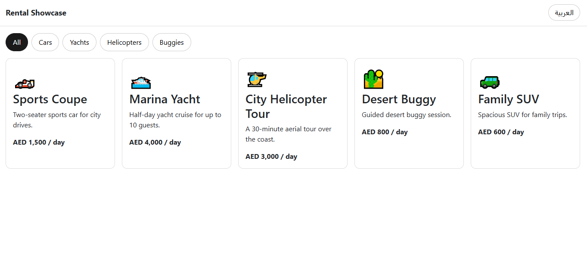
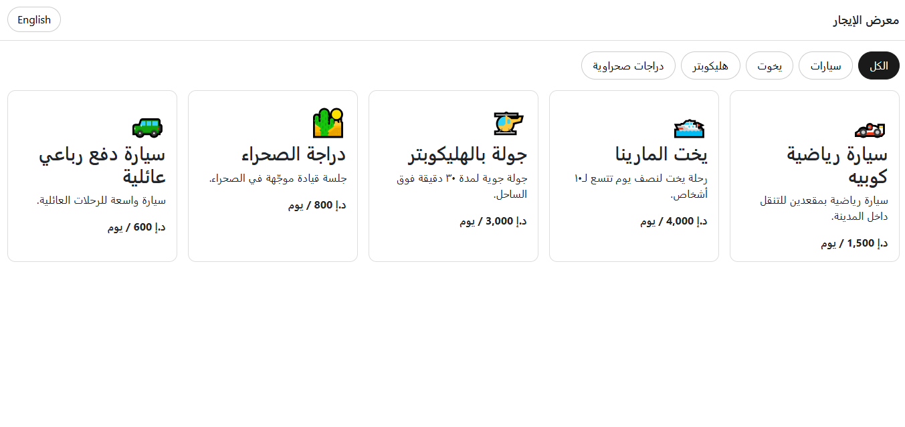
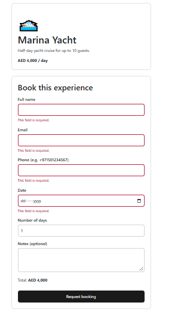

# Rental Showcase

A small Angular 17 app that lists luxury rental experiences (cars, yachts, helicopters, desert buggies) with filtering, a details page, a booking form, and English/Arabic support with RTL layout.

## Features

- Listings page with loading, empty and error states
- Category filter built with RxJS (`BehaviorSubject` + `combineLatest`)
- Details page with routing (`/listing/:id`) using `switchMap`
- Booking form built with Reactive Forms: validation (required, email, phone pattern, custom no-past-date validator), live total, and accessible error messages
- English / Arabic toggle with RTL layout, built with signals
- Data fetched through `HttpClient` from a JSON file (easy to swap for a real API URL)
- Unit tests with Jasmine and Karma
- SSR-compatible: uses the `DOCUMENT` token instead of the global `document`

## Tech

Angular 17 (standalone components, built-in control flow), TypeScript, RxJS, Reactive Forms, Jasmine/Karma.

## Screenshots

| English                                             | Arabic (RTL)                                       |
| --------------------------------------------------- | -------------------------------------------------- |
|  |  |



## Run locally

```bash
npm install
ng serve
ng test
```

## Notes

- Sample data only. It is not connected to any real service.
- The booking form is a demo: it does not send data anywhere.
- Built with AI assistance. I can walk through and modify any part of the code.

## Live demo

https://anas-desoki-dev.github.io/rental-showcase/
